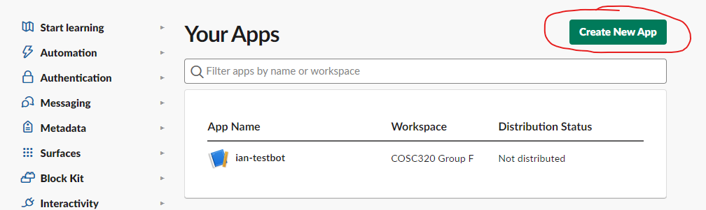
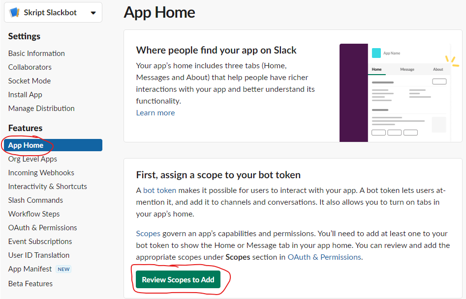
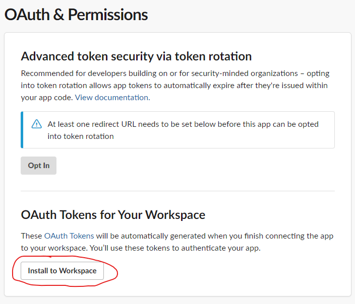
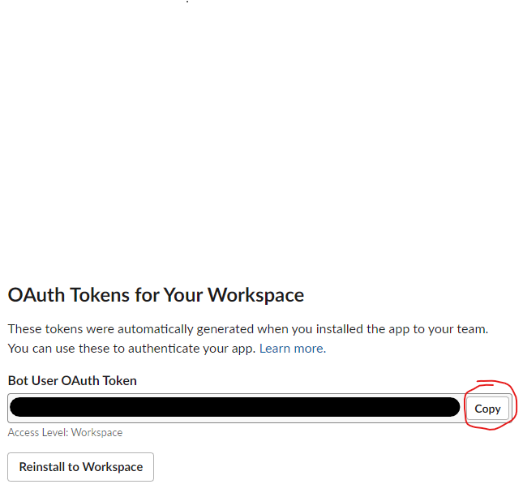
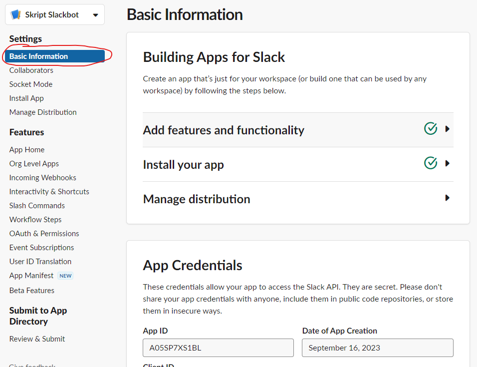
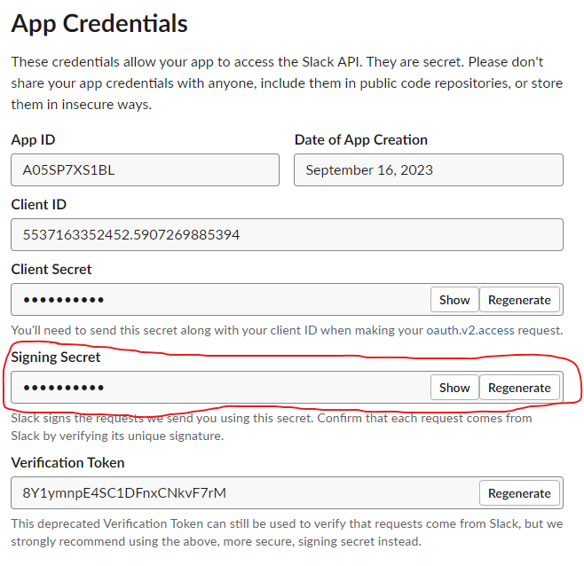
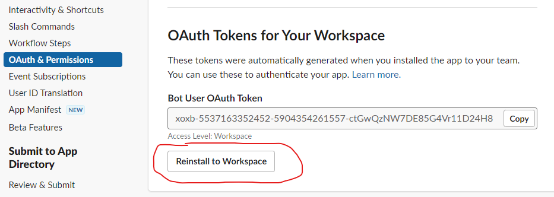

# Deployment Instructions

## Setting up bot in Slack

To create the slack application navigate to the slack console: [https://api.slack.com/](https://api.slack.com/) and click on the `Your Apps` link.


Then click `Create New App` and choose `From scratch`, then provide an name for the App and select the workspace to install the app in. Once done click `Create App`




Now navigate to `App Home` and Click to `Review Scopes to Add`



Scroll down to the Scope section, click on the `Add an OAuth Scopes` button and under `Bot Token Scopes` add `chat:write` and `channels:history`.


Then scroll back up and click `Install to Workspace`, and press on `Allow` to generate an OAuth token.



Once installed copy the Bot User OAuth token. This will need to be set as the BOT_SLACK_TOKEN environment variable.



You will also need to obtain the signing secret from the Basic Information tab and set it as the BOT_SIGNING_SECRET environment variable.





Now the bot needs to be subscribed to events. Navigate to the Event Subscriptions page and Enable Events.


Then under `Subscribe to bot events` add the message.channels event


At this point the bot will need to be running and accessible, so that the Request URL can be set. The Request URL needs to be set to the `/slack/events` path on whatever IP or URL has been configured to point to the server where the bot is running.
When the Request URL is set a request will be set with a challenge parameter to verify it, so the bot needs to be running so it can respond to the challenge and validate the URL. Once verified, click to `Save Changes`.


Finally, click the `Reinstall to Workspace` button on the `OAuth & Permissions` page.



## Running nats in local environment

### Pre-requisites

- Install AWS CLI - [https://docs.aws.amazon.com/cli/latest/userguide/getting-started-install.html](https://docs.aws.amazon.com/cli/latest/userguide/getting-started-install.html)
- Install NATS CLI - [https://nats.io/blog/nats-cli-intro/](https://nats.io/blog/nats-cli-intro/)
- Install kubectl  - [https://kubernetes.io/docs/tasks/tools/install-kubectl-windows/](https://kubernetes.io/docs/tasks/tools/install-kubectl-windows/)

Step 1 - Run 'aws configure' and pass in the credentials obtained from skript.

```text
Access: <ACCESS_KEY>
Secret: <SECRET_KEY>
Region: ap-southeast-2
```

Step 2 - Connect kubectl to the cluster

`aws eks update-kubeconfig --region ap-southeast-2 --name product-eks-cluster`

Step 3 - Setup a port-forward from your localhost:4222 to our DEV nats server

`kubectl port-forward service/nats 4222`

Step 4 - Confirm NATs connectivity (in another terminal window). This is the safest command to run as it doesn't actually trigger any processing or change any data - so you can run it as many times as you like

`nats req 'organisations.v1.query' '{}'`
