# skript-slackbot

Slackbot designed to automate common admin tasks for Skript

## Setting up bot in Slack

To create the slack application navigate to the slack console: [https://api.slack.com/](https://api.slack.com/) and click on the `Your Apps` link.

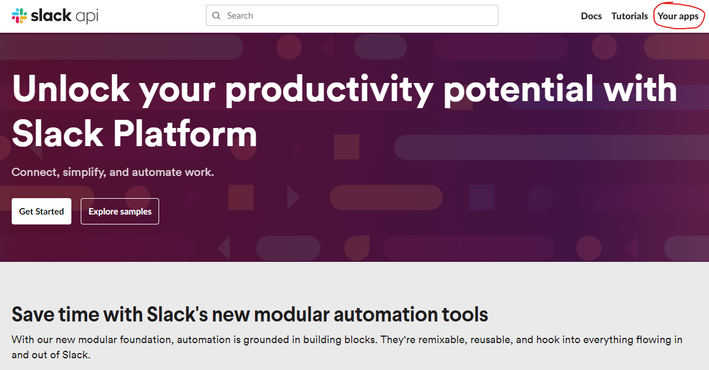

Then click `Create New App` and choose `From scratch`, then provide an name for the App and select the workspace to install the app in. Once done click `Create App`

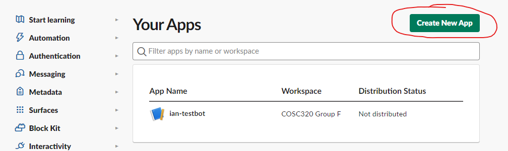

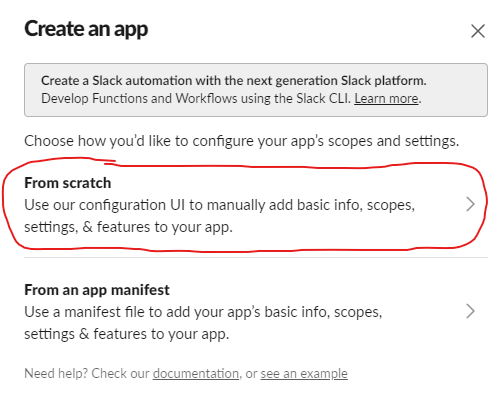

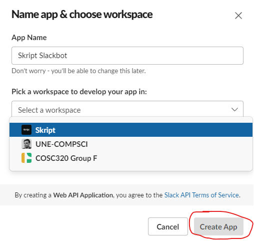

Now navigate to `App Home` and Click to `Review Scopes to Add`

Scroll down to the Scope section, click on the `Add an OAuth Scopes` button and under `Bot Token Scopes` add `chat:write` and `channels:history`.

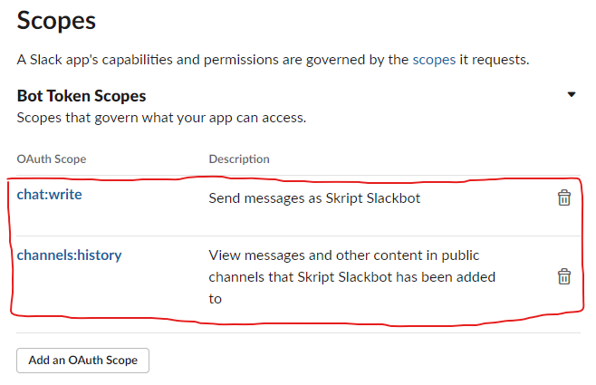

Then scroll back up and click `Install to Workspace`, and press on `Allow` to generate an OAuth token.

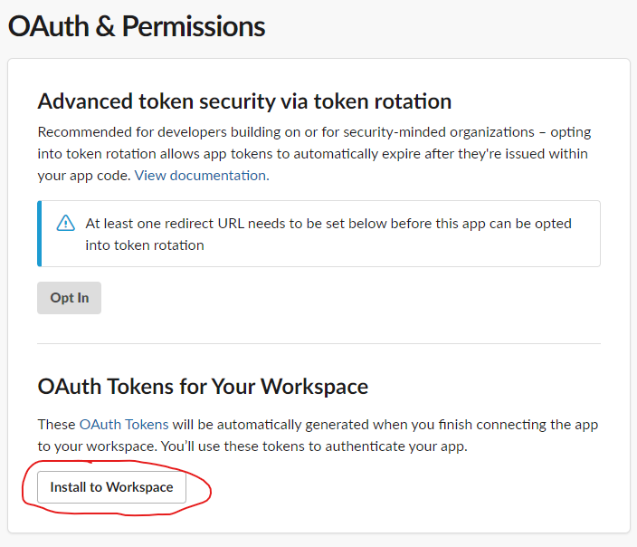

Once installed copy the Bot User OAuth token. This will need to be set as the BOT_SLACK_TOKEN environment variable.

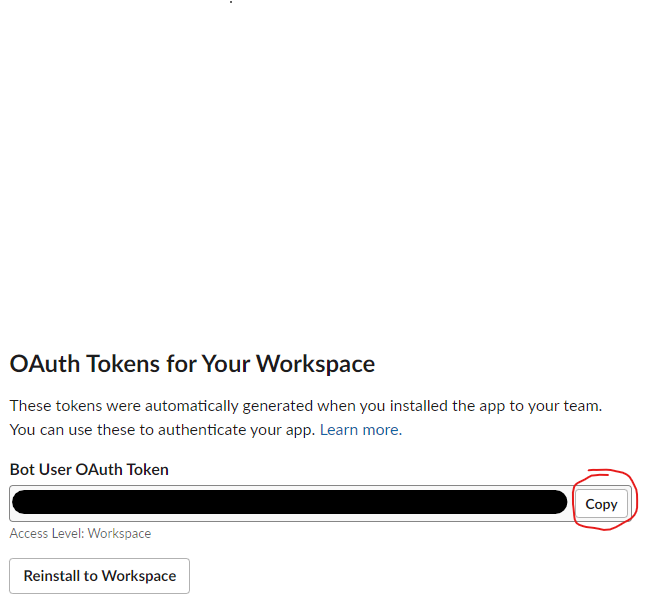

You will also need to obtain the signing secret from the Basic Information tab and set it as the BOT_SIGNING_SECRET environment variable.

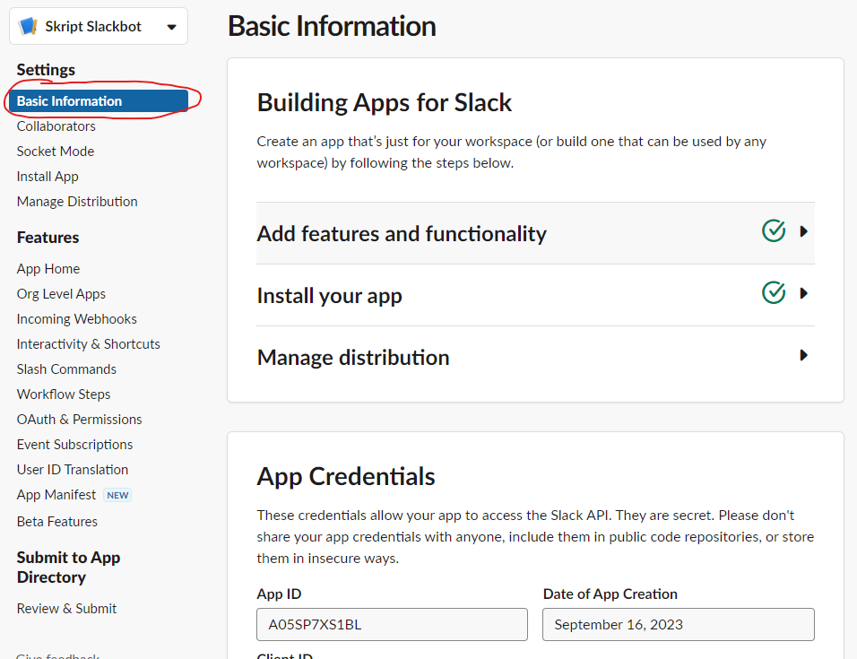

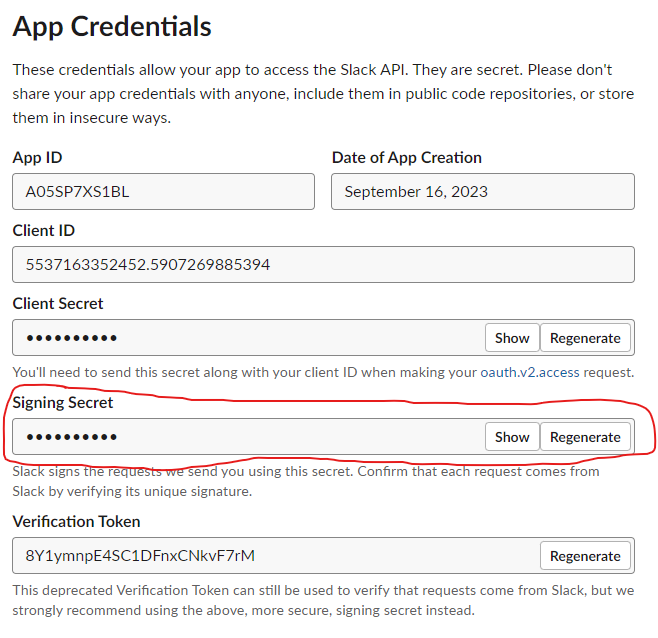

Now the bot needs to be subscribed to events. Navigate to the Event Subscriptions page and Enable Events.

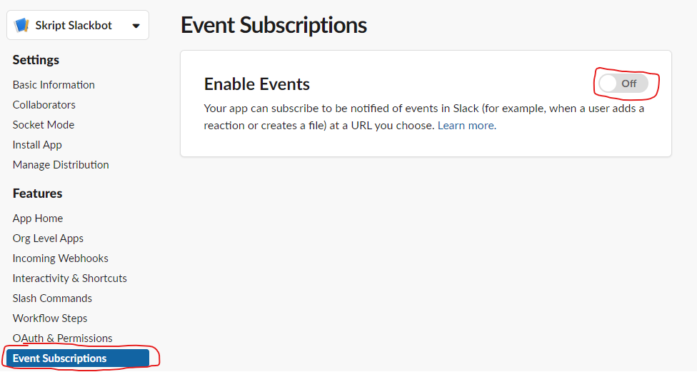

Then under `Subscribe to bot events` add the message.channels event

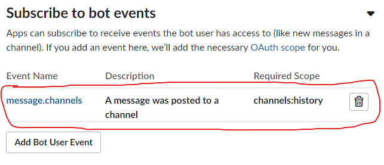

At this point the bot will need to be running and accessible, so that the Request URL can be set. The Request URL needs to be set to the `/slack/events` path on whatever IP or URL has been configured to point to the server where the bot is running.
When the Request URL is set a request will be set with a challenge parameter to verify it, so the bot needs to be running so it can respond to the challenge and validate the URL. Once verified, click to `Save Changes`.

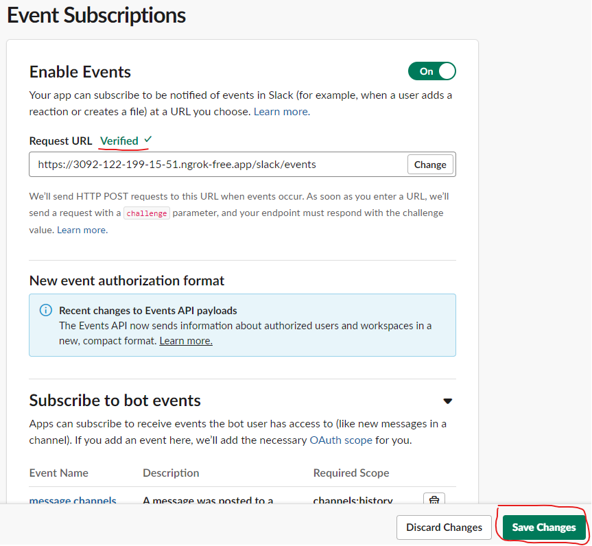

Finally, click the `Reinstall to Workspace` button on the `OAuth & Permissions` page.

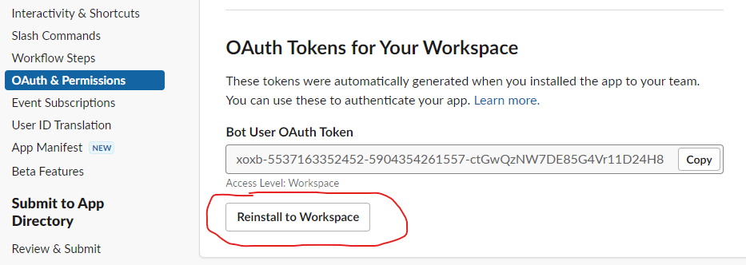

## Running via Docker

### Requirements

[Docker Engine](https://docs.docker.com/engine/install/)

### Usage

`docker compose up`

### Environment variables

- BOT_SLACK_TOKEN - The bot user oauth token
- BOT_SIGNING_SECRET - The bot signing secret
- BOT_PORT - The port the bot will run on
- BOT_NATS_URL - The url of the nats server i.e. nats://host.docker.internal:4222

## Running Directly

### Requirements

[Python3](https://www.python.org/downloads/)

`pip install slackclient flask slackeventsapi nltk nats-py`

Needs [ngrok](https://ngrok.com/) for hosting the slackbot locally

### Usage

`python slackbot.py`

### Environment variables

- SLACK_TOKEN The slack token authorising access for the bot
- SIGNING_SECRET The signing secret used to verify slack events
- PORT The port the bot will run on
- NATS_URL - The url of the nats server i.e. nats://127.0.0.1:4222
